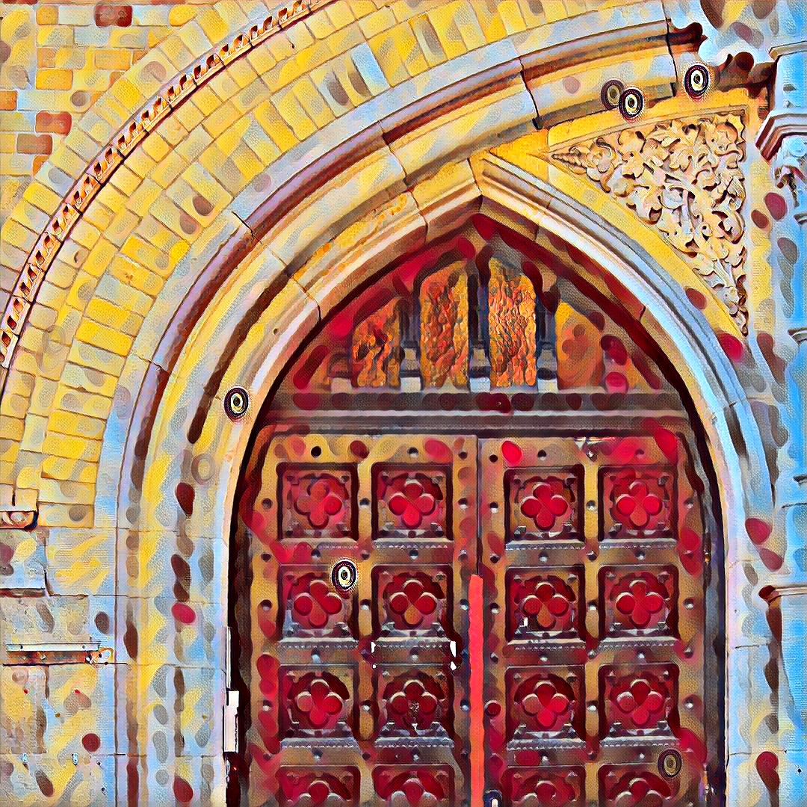
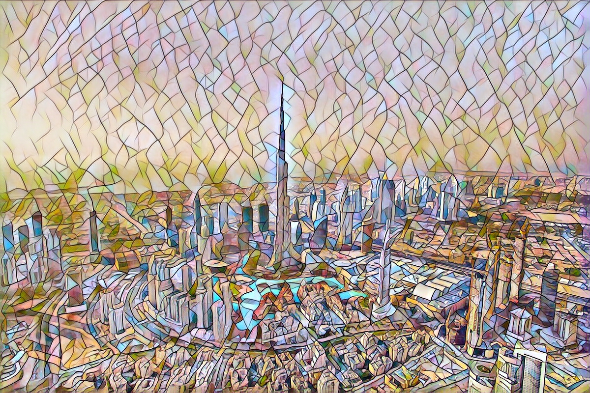
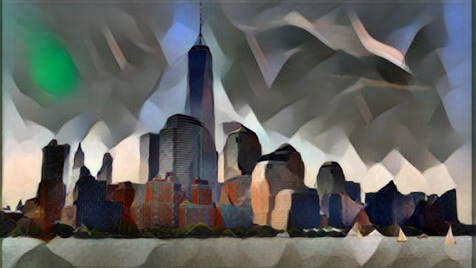
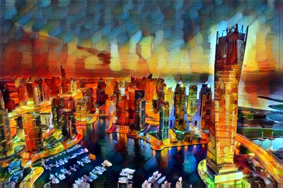
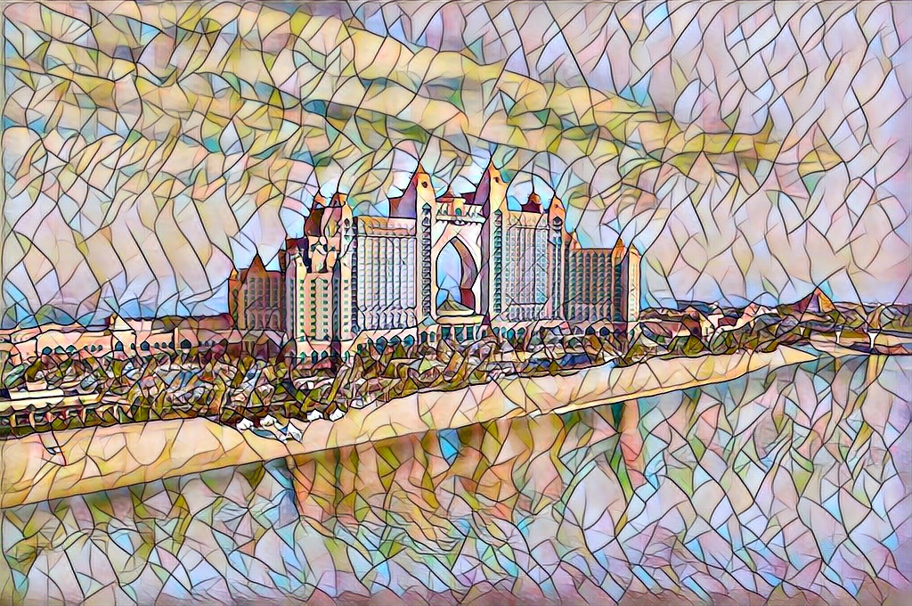

# Basic Deepart Pytorch Streamlit App 

Made with Streamlit ❤️

### Original inspiration : [Deepart](https://deepart.io)

### Pytorch implementation of Fast Style Transfer along with models have been downloaded from : [Pytorch Fast Style Transfer](https://github.com/pytorch/examples/tree/master/fast_neural_style)

### Original paper : [ Perceptual Losses for Real-Time Style Transfer and Super-Resolution](https://arxiv.org/abs/1603.08155). [Instance Normalization](https://arxiv.org/pdf/1607.08022.pdf) has also been used for training the models.

#### You can download all the saved models from [here](https://www.dropbox.com/s/lrvwfehqdcxoza8/saved_models.zip?dl=0).

### Some beautiful stylised images created with this web-app

## What the heck is style-transfer
Style transfer is a computer vision technique that allows us to recompose the content of an image in the style of another. If you’ve ever imagined what a photo might look like if it were painted by a famous artist, then style transfer is the computer vision technique that turns this into a reality.

Early versions of Neural Style Transfer were quite slow, and took days to train and hours to generate a stylised image. They treated the task as an optimization problem, requiring hundreds or thousands of iterations to perform style transfer on a single image. To tackle this inefficiency, researchers developed what’s referred to as fast neural style transfer. Fast style transfer also uses deep neural networks but trains a standalone model to transform any image in a single, feed-forward pass. Trained models can stylize any image with just one iteration through the network, rather than thousands.

Everyone is not born an artist. But that should not stop people like you and me to stop creating artistic images. This is where the transformative power of style transfer lies. Artists can easily lend their creative aesthetic to others, allowing new and innovative representations of artistic styles to live alongside original masterpieces. In addition to empowering people all around the world to experiment with their own creativity, we see the importance of style transfer playing out in the commercial art world.

### Basic overview of how style transfer works
In general, deep learning architectures suitable for style transfer are based on variations of convolutional neural networks (CNNs). 

Training a style transfer model requires two networks: a pre-trained feature extractor and a transfer network. The pre-trained feature extractor is used to avoid having to us paired training data. It’s usefulness arises from the curious tendency for individual layers of deep convolutional neural networks trained for image classification to specialize in understanding specific features of an image.

Some layers learn to extract the content of an image (the shape of a dog or the position of a car), while others learn to focus on texture (the small brush strokes of a painter or the fractal patterns of nature). Style transfer exploits this by running two images through a pre-trained neural network, looking at the pre-trained network’s output at multiple layers, and comparing their similarity. This comparison is done by using something called Gram Matrix (for the style loss). Won't go into the technical details of it here though. Images that produce similar outputs at one layer of the pre-trained model likely have similar content, while matching outputs at another layer signals similar style.

The pre-trained model enables us to compare the content and style of two images, but it doesn't actually help us create the stylized image. That’s the job of a second neural network, which we’ll call the transfer network. The transfer network is an image translation network that takes one image as input and outputs another image. Transfer networks typically have an encode-decoder architecture.

The quality of the stylized image is defined by a custom loss function that has terms for both content and style. The extracted content features of the stylized image are compared to the original content image, while the extracted style features are compared to those from the reference style image(s). After each step, only the transfer network is updated. The weights of the pre-trained feature extractor remain fixed throughout. By weighting the different terms of the loss function, we can train models to produce output images with lighter or heavier stylization.

A 2016 paper by Johnson et al was the first to train an independent neural network to stylize images in a single, feed-forward pass. Large VGG16 models pre-trained on ImageNet are used for feature extractors, and a relatively small encoder-decoder network serves as the transfer network. In this approach, a single transfer network is trained for each desired style.
